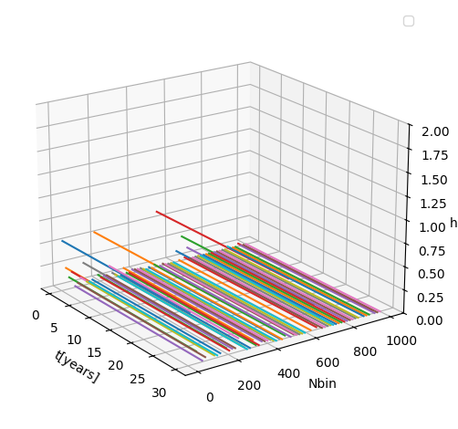

## Low Frequencies gravitational waves

A project that simulates low frequencies gravitational waves coming from binary systems of black holes scattered over a certain distance. I've used real-world equations to graph the dependance of the total strain created by those randomly generated black holes relative to the number of galaxies per which such systems are created. This assumes the former existence of all the galaxies.

---

In order to run the simulation on linux, one must only make running.sh executable by a command `chmod +x running.sh`, while being in the project's folder. Then the rest is to run it using `./running.sh`. In order to change certain constants in the code, you can edit the bash file to accomodate your needs. 

Side note: R is a radius that will be later multiplied by Mpc. This means that if you want to get a radius of 8Gpc, write R=8e3. 

---

A sample plot generated by the simulation, after using the default constants in the file running.sh

We can learn from it that the lower the Nbin, and the more black holes are present, the stronger the signal, which, most probably, is still dominated by a small number of black holes. The signals with huge amounts of black holes tend to be almost stable, with neglegible changes over time.